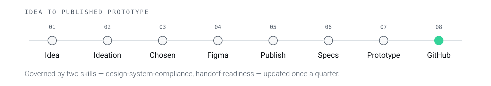

<picture>
  <source media="(prefers-color-scheme: dark)" srcset=".github/readme/banner-dark.svg">
  
</picture>

**[konstancja-tanjga.github.io/portfolio-site](https://konstancja-tanjga.github.io/portfolio-site/)**

[Big Hat, in Storybook](https://konstancja-tanjga.github.io/bighat-design-system/) ·
[LinkedIn](https://linkedin.com/in/konstancja-tanjga) ·
[tanjgakonstancja@gmail.com](mailto:tanjgakonstancja@gmail.com) ·
Warsaw, CET · remote only

---

I design products and lead the implementation of the design system they run on.
Currently Lead Designer / UX Engineer for APplus ERP — **ERP System of the Year
2025, UX category** — where I designed three applications from zero on a design
system I built from nothing and still develop.

Development receives a working React prototype built from those components, not
a picture of one.

|  |  |
|---|---|
| **4** | products designed from zero |
| **~80** | components in the design system |
| **6** | products consuming it |

## How the work runs

<picture>
  <source media="(prefers-color-scheme: dark)" srcset=".github/readme/process-dark.svg">
  
</picture>

Based on the documented [design-to-code workflow](https://github.com/FlorianBruniaux/claude-code-ultimate-guide/blob/main/guide/workflows/design-to-code.md)
with four stages of my own: Storybook as the acceptance contract, Chromatic for
visual regression, my own merge as the only review gate, and Nexus for storing
and versioning the system.

## Skills

Two Claude Code skills govern the stages above, so the process is enforced by
something written down rather than by whoever is at the keyboard. Both live in
the design system, because that is where the rules they check are defined — one
description of a rule, not two that drift apart.

### Mine

| Skill | What it does |
| --- | --- |
| [`bighat-design-system`](https://github.com/Konstancja-Tanjga/bighat-design-system/blob/main/agent/SKILL.md) | Thirteen rules a correct-looking, type-checking, lint-passing component can still break: primitives, the scale, `StateBlock`, labels, focus, colour, drag. The rules the libraries cannot enforce at the type level. |
| [`handoff-readiness`](https://github.com/Konstancja-Tanjga/bighat-design-system/tree/main/skills/handoff-readiness) | Runs those rules as ten gates over a branch before it becomes a pull request — build, design-system alignment, requirements, a real click-through of the running prototype, states, accessibility, themes, widths, copy, closeout — and returns one verdict per gate with the evidence behind it. It reports: it does not edit code, open the pull request, or declare the work done. |

`handoff-readiness` carries its own
[tests](https://github.com/Konstancja-Tanjga/bighat-design-system/tree/main/skills/handoff-readiness/tests):
the trigger phrases it has to fire on in both working languages, a branch with
one seeded defect per gate, and the criteria it is measured against. A checker
that is never checked is a claim like any other.

This repository keeps only [`.claude/handoff.json`](.claude/handoff.json) — the
config naming what this project is made of, which is the part that cannot live
in the design system because it describes a consumer of it.

### Borrowed

Anthropic's, not mine — linked rather than copied in.

| Skill | Used for |
| --- | --- |
| [`skill-creator`](https://github.com/anthropics/skills/tree/main/skills/skill-creator) | Drafting, evaluating and benchmarking the skills above |
| [`mcp-builder`](https://github.com/anthropics/skills/tree/main/skills/mcp-builder) | Building MCP servers |

## What is on the site

| Band | | |
|---|---|---|
| **Products** | 10 walls | APplus Analytics · Documents · Elly · Volvo · Xecta · Riyad Bank · MojePZU · Deloitte |
| **Practice** | 2 walls | FOX design system · Futures Thinking |
| **Recognition** | 3 short pages | ERP of the Year · Bydgoszcz · Possible Reality |

Plus **Watercolours** — architecture, birds, animals, people. Deliberately off
the work page.

## The site is the artefact

The point of building this rather than posting to Behance: it is a real consumer
of my own published design system, not a description of one.
[`@bighatpoland/ui`](https://github.com/bighatpoland/bighat-design-system) is
installed as a dependency, its tokens drive every colour, and the footer prints
the installed version — so the claim is checkable rather than asserted.

```
site/src/
  content/    the walls, as data — never markup
  system/     the closed set of components every page renders with
  components/ masthead, chapter renderer, jump bar
  pages/      Home · Case · Watercolours · About
```

A wall is a list of chapters; a chapter is a list of blocks. Adding a section
means adding an object to a content file, not writing a component.

## Run it

```bash
cd site && npm install
npm run dev
```

Build, deploy, image specs and the pre-publish checklist:
**[site/README.md](site/README.md)**.

---

<sub>**FOX** is Asseco Solutions' design system and belongs to them. This
repository contains none of its code and none of its assets. **Big Hat** is
mine, MIT-licensed, and is what this site is built on.</sub>
