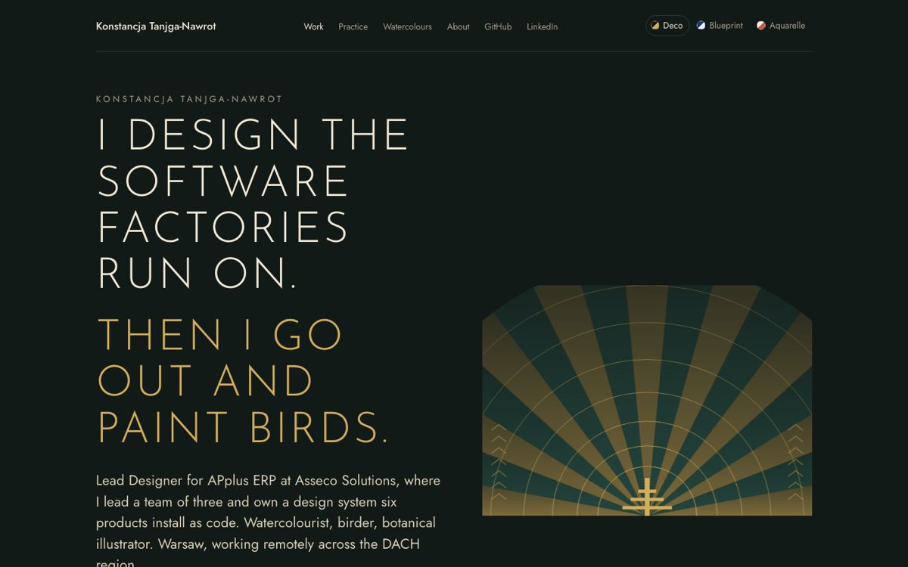
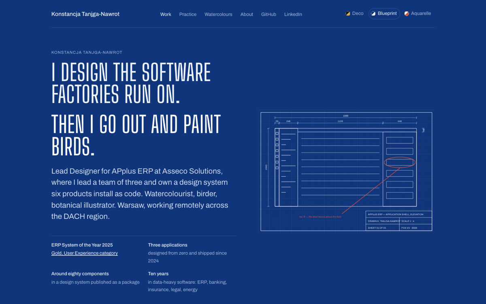
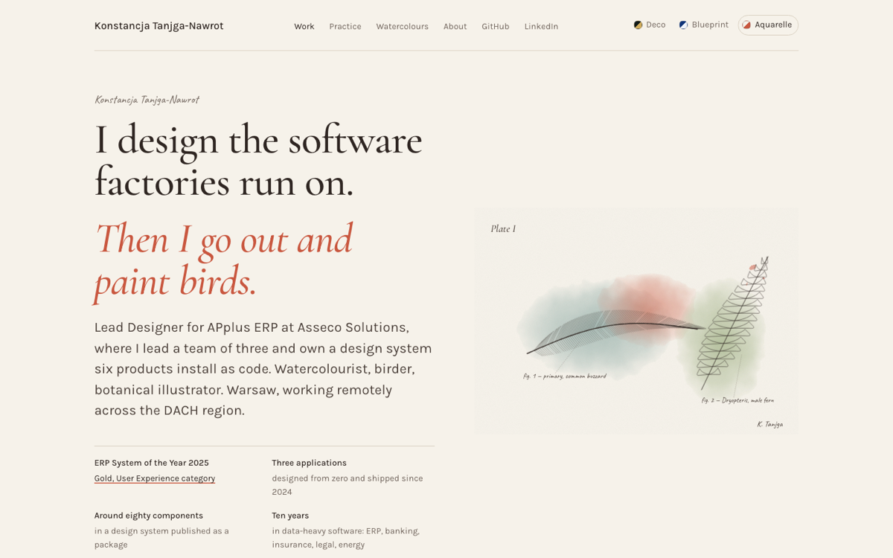
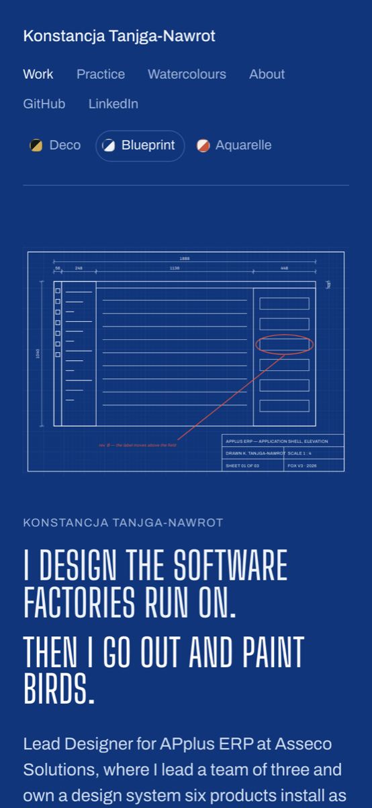

# Redesign, October 2026: a portfolio with skins

The brief, in Konstancja's words: the site was boring. It did not say who she
is (a designer, a watercolourist, someone who goes out to look at birds and
draws plants the way botanical plates do), and it did not say anything
visually about the work. It should sell her to the people who hire lead
designers.

## What was decided

**One argument, not a list.** The home page now makes one claim and then
earns it: the eye that identifies a buzzard from twenty field marks is the
eye that designs an ERP screen from the handful of facts a planner needs.
Sections follow in that order: who, what is on the desk now at Asseco
Solutions, the shipped work, where the career came from, and what the same
hands do off screen.

**Skins, like a music player once had.** The reader picks the art direction
and the browser remembers it. Three ship:

| Skin | Medium | Type |
| --- | --- | --- |
| Deco | Lacquer-black green, old gold, stepped light. A fan rises behind the claim. | Josefin Sans, Jost |
| Blueprint | A cyanotype drawing sheet. The hero is an elevation of the APplus shell at its real pixel dimensions (rail 56, panel 248, content 1136, side sheet 448), with a title block and one red-pencil revision. | Big Shoulders Display, Archivo |
| Aquarelle | Cold-pressed paper. A botanical plate: a buzzard's primary feather and a fern frond, inked over washes whose edges are displaced by noise so they bleed like wet paint. | Cormorant Garamond, Karla, Caveat |

A skin re-points the site's token aliases, so the case studies follow the
palette too, and tells the design system whether it is dark or light so its
own components agree with the ground. `skins.css` is the one file on the site
allowed to state colour; `tokens.css` stays an alias layer onto the package
and the content check still holds it to that.

**Motion once.** Each skin draws its hero once on load (rays grow, lines
draw, washes bloom), the text arrives after the drawing has begun, and
nothing else on the page moves on its own. `prefers-reduced-motion` stops
all of it.

**Search.** The page did not appear for "konstancja tanjga portfolio". The
build now writes `sitemap.xml` and `robots.txt`, the title carries the word
*portfolio* and the short form of the name, and `index.html` carries a
schema.org `Person` with the LinkedIn and GitHub profiles as `sameAs`. What
the build cannot do is prove ownership: Search Console verification is a
step for Konstancja, in the notes below.

## Screens

| | |
| --- | --- |
|  |  |
|  |  |

The full aquarelle page: [home-aquarelle-full.png](home-aquarelle-full.png).
A case cover in aquarelle, to show the skin following onto the walls:
[case-cover-aquarelle.png](case-cover-aquarelle.png).

## Research notes

What the portfolio advice of 2026 agrees on: a hiring manager gives a
portfolio ten to twenty seconds, wants role and specialisation visible without
scrolling, wants three deep case studies over ten thumbnails, wants the
problem, the decisions and the measured outcome, and now wants to see how AI
is used, specifically. All of that was already on this site in the walls; what
was missing was the person and the first ten seconds. Sources:
[Muzli](https://muz.li/blog/how-to-build-a-ux-portfolio-that-actually-gets-you-hired-2026/),
[Maven](https://maven.com/p/bb7a31/how-to-build-a-design-portfolio-that-gets-you-hired),
[Lovart](https://www.lovart.ai/blog/ai-design-portfolio-interview-2026).

On GitHub Pages and search: Google Search Console is known to report
"could not be read" for sitemaps on `github.io` even when the file is fine;
submitting the URL directly and having the links from LinkedIn and GitHub
still works. Source:
[dev.to](https://www.dev.to/stankukucka/google-search-console-cant-fetch-sitemap-on-github-pages-31kn).

## Still to do by hand

1. Verify the site in Google Search Console (HTML tag method: add the
   `google-site-verification` meta tag to `site/index.html`), then submit
   `https://konstancja-tanjga.github.io/portfolio-site/sitemap.xml` and
   request indexing of the home page.
2. Put the portfolio URL in the LinkedIn profile's website field and in the
   GitHub profile. Those two links are the strongest signal Google has that
   the portfolio, not Behance, is the current one.
3. On Behance, add the portfolio URL to the profile, or retire the profile.
